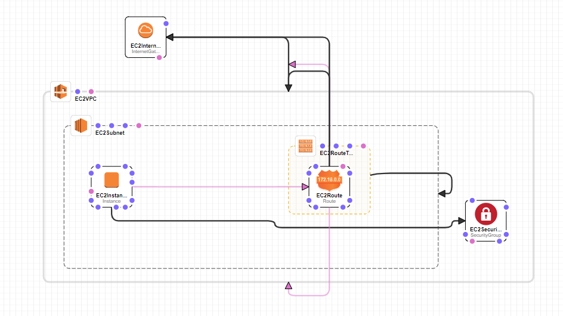

# EC2 Instance + Security Group within VPC With a Subnet -> InternetGateway

This template creates an EC2 instance and Security group within a VPC that has a public subnet within. The subnet is connected to the Internet Gateway using the RouteTable and Route. Made with CloudFormation designer. The image can be seen below.


## Template:

```YAML
AWSTemplateFormatVersion: 2010-09-09
Metadata:
  'AWS::CloudFormation::Designer':
    1731439e-5271-4392-989d-c5f3b77b813b:
      size:
        width: 720
        height: 280
      position:
        x: 100
        'y': 80
      z: 0
      embeds:
        - 72db1cab-ce84-4db2-a96a-3c38fa2a8066
        - b755c46a-a1b0-46f4-90cd-7d90f975f1be
    72db1cab-ce84-4db2-a96a-3c38fa2a8066:
      size:
        width: 550
        height: 210
      position:
        x: 130
        'y': 130
      z: 1
      parent: 1731439e-5271-4392-989d-c5f3b77b813b
      embeds:
        - f63dd2e9-a17d-41f7-9553-cec901789514
        - 5133d4a8-8cdf-49ca-bb0b-7a7e72f52163
      iscontainedinside:
        - 1731439e-5271-4392-989d-c5f3b77b813b
        - 1731439e-5271-4392-989d-c5f3b77b813b
        - 1731439e-5271-4392-989d-c5f3b77b813b
        - 1731439e-5271-4392-989d-c5f3b77b813b
        - 1731439e-5271-4392-989d-c5f3b77b813b
        - 1731439e-5271-4392-989d-c5f3b77b813b
        - 1731439e-5271-4392-989d-c5f3b77b813b
        - 1731439e-5271-4392-989d-c5f3b77b813b
        - 1731439e-5271-4392-989d-c5f3b77b813b
        - 1731439e-5271-4392-989d-c5f3b77b813b
        - 1731439e-5271-4392-989d-c5f3b77b813b
        - 1731439e-5271-4392-989d-c5f3b77b813b
        - 1731439e-5271-4392-989d-c5f3b77b813b
        - 1731439e-5271-4392-989d-c5f3b77b813b
    5421e7e2-c204-42a5-b678-ae312882df20:
      size:
        width: 60
        height: 60
      position:
        x: 220
        'y': -30
      z: 0
      embeds: []
    ea488b4a-cca6-484f-86a9-061e9e73253c:
      source:
        id: 1731439e-5271-4392-989d-c5f3b77b813b
      target:
        id: 5421e7e2-c204-42a5-b678-ae312882df20
      z: 0
    f63dd2e9-a17d-41f7-9553-cec901789514:
      size:
        width: 120
        height: 100
      position:
        x: 460
        'y': 160
      z: 2
      parent: 72db1cab-ce84-4db2-a96a-3c38fa2a8066
      embeds:
        - 1faaf9f6-52e0-4c14-9409-3336f511f617
      iscontainedinside:
        - 1731439e-5271-4392-989d-c5f3b77b813b
    04fd3415-097a-475d-9827-84af08db4a78:
      source:
        id: f63dd2e9-a17d-41f7-9553-cec901789514
      target:
        id: 72db1cab-ce84-4db2-a96a-3c38fa2a8066
      z: 2
    1faaf9f6-52e0-4c14-9409-3336f511f617:
      size:
        width: 60
        height: 60
      position:
        x: 490
        'y': 190
      z: 3
      parent: f63dd2e9-a17d-41f7-9553-cec901789514
      embeds: []
      isassociatedwith:
        - 5421e7e2-c204-42a5-b678-ae312882df20
      iscontainedinside:
        - f63dd2e9-a17d-41f7-9553-cec901789514
        - f63dd2e9-a17d-41f7-9553-cec901789514
        - f63dd2e9-a17d-41f7-9553-cec901789514
        - f63dd2e9-a17d-41f7-9553-cec901789514
        - f63dd2e9-a17d-41f7-9553-cec901789514
      dependson:
        - 1731439e-5271-4392-989d-c5f3b77b813b
        - ea488b4a-cca6-484f-86a9-061e9e73253c
    b755c46a-a1b0-46f4-90cd-7d90f975f1be:
      size:
        width: 60
        height: 60
      position:
        x: 720
        'y': 240
      z: 1
      parent: 1731439e-5271-4392-989d-c5f3b77b813b
      embeds: []
      iscontainedinside:
        - 1731439e-5271-4392-989d-c5f3b77b813b
        - 1731439e-5271-4392-989d-c5f3b77b813b
    5133d4a8-8cdf-49ca-bb0b-7a7e72f52163:
      size:
        width: 60
        height: 60
      position:
        x: 170
        'y': 190
      z: 2
      parent: 72db1cab-ce84-4db2-a96a-3c38fa2a8066
      embeds: []
      iscontainedinside:
        - 72db1cab-ce84-4db2-a96a-3c38fa2a8066
        - 72db1cab-ce84-4db2-a96a-3c38fa2a8066
        - 72db1cab-ce84-4db2-a96a-3c38fa2a8066
      dependson:
        - 1faaf9f6-52e0-4c14-9409-3336f511f617
Resources:
  EC2VPC:
    Type: 'AWS::EC2::VPC'
    Properties:
      CidrBlock: 10.0.0.0/16
      EnableDnsSupport: 'true'
      EnableDnsHostnames: 'true'
    Metadata:
      'AWS::CloudFormation::Designer':
        id: 1731439e-5271-4392-989d-c5f3b77b813b
  EC2Subnet:
    Type: 'AWS::EC2::Subnet'
    Properties:
      VpcId: !Ref EC2VPC
      CidrBlock: 10.0.0.0/24
      AvailabilityZone: us-east-1a
    Metadata:
      'AWS::CloudFormation::Designer':
        id: 72db1cab-ce84-4db2-a96a-3c38fa2a8066
  EC2InternetGateway:
    Type: 'AWS::EC2::InternetGateway'
    Properties: {}
    Metadata:
      'AWS::CloudFormation::Designer':
        id: 5421e7e2-c204-42a5-b678-ae312882df20
  EC2VPCG3DAR3:
    Type: 'AWS::EC2::VPCGatewayAttachment'
    Properties:
      InternetGatewayId: !Ref EC2InternetGateway
      VpcId: !Ref EC2VPC
    Metadata:
      'AWS::CloudFormation::Designer':
        id: ea488b4a-cca6-484f-86a9-061e9e73253c
  EC2RouteTable:
    Type: 'AWS::EC2::RouteTable'
    Properties:
      VpcId: !Ref EC2VPC
    Metadata:
      'AWS::CloudFormation::Designer':
        id: f63dd2e9-a17d-41f7-9553-cec901789514
  EC2SRTA48521:
    Type: 'AWS::EC2::SubnetRouteTableAssociation'
    Properties:
      RouteTableId: !Ref EC2RouteTable
      SubnetId: !Ref EC2Subnet
    Metadata:
      'AWS::CloudFormation::Designer':
        id: 04fd3415-097a-475d-9827-84af08db4a78
  EC2Route:
    Type: 'AWS::EC2::Route'
    Properties:
      RouteTableId: !Ref EC2RouteTable
      GatewayId: !Ref EC2InternetGateway
      DestinationCidrBlock: 0.0.0.0/0
    Metadata:
      'AWS::CloudFormation::Designer':
        id: 1faaf9f6-52e0-4c14-9409-3336f511f617
    DependsOn:
      - EC2VPC
      - EC2VPCG3DAR3
  EC2SecurityGroup:
    Type: 'AWS::EC2::SecurityGroup'
    Properties:
      GroupDescription: Allow access from HTTP and SSH traffic
      SecurityGroupIngress:
        - IpProtocol: tcp
          FromPort: '80'
          ToPort: '80'
          CidrIp: 0.0.0.0/0
        - IpProtocol: tcp
          FromPort: '22'
          ToPort: '22'
          CidrIp: 0.0.0.0/0
      VpcId: !Ref EC2VPC
    Metadata:
      'AWS::CloudFormation::Designer':
        id: b755c46a-a1b0-46f4-90cd-7d90f975f1be
  EC2Instance:
    Type: 'AWS::EC2::Instance'
    Properties:
      ImageId: 'ami-07090631d18ab7358'
      InstanceType: 't2.micro'
      NetworkInterfaces:
        - GroupSet:
            - !Ref EC2SecurityGroup
          AssociatePublicIpAddress: 'true'
          DeviceIndex: '0'
          DeleteOnTermination: 'true'
          SubnetId: !Ref EC2Subnet
    Metadata:
      'AWS::CloudFormation::Designer':
        id: 5133d4a8-8cdf-49ca-bb0b-7a7e72f52163
    DependsOn:
      - EC2Route
```